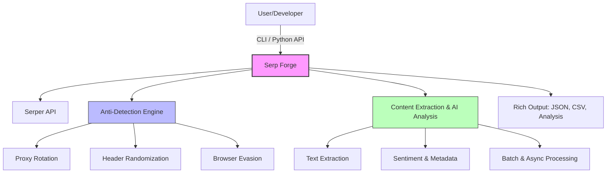

# Serp Forge 🚀

> **The next-generation search & web intelligence engine for developers, analysts, and AI workflows.**

---

## 🌟 Vision & Purpose

Serp Forge empowers you to **search, extract, and analyze the world's information** with ease, speed, and stealth. Whether you're building data-driven products, monitoring trends, or fueling AI models, Serp Forge is your all-in-one toolkit for:

- **Unrestricted search** across web, news, images, and videos
- **Anti-detection scraping** with IP rotation, browser evasion, and header randomization
- **AI-powered content extraction** and sentiment/meta analysis
- **Batch, async, and high-performance workflows**
- **Rich, ready-to-use outputs** for analytics, ML, and reporting

> **Purpose:** Democratize access to web data, making advanced search and extraction accessible, ethical, and developer-friendly.

---

## 🛠️ How Serp Forge Works



---

## 🚀 Quick Start

```bash
# Install
pip install serp-forge

# Set API key
export SERPER_API_KEY="your_api_key_here"

# Basic usage
serp-forge search "AI news 2025" --max-results 10
```

---

## 🧠 Why Serp Forge?

- **No more blocks:** Advanced anti-detection, proxy, and browser evasion built-in
- **AI-native:** Sentiment, metadata, and content extraction for downstream ML/analytics
- **Lightning fast:** Async, batch, and parallel scraping for scale
- **Developer-first:** Python API, CLI, config, and rich output formats
- **Ethical & transparent:** Designed for responsible, legal, and auditable use

---

## 🐍 Python Usage

```python
import serp_forge as sf

# Simple search and scrape
results = sf.scrape("latest AI news", max_results=10)

# News search
news = sf.scrape("blockchain technology", search_type="news", max_results=5)

# Batch processing
queries = ["AI trends", "ML news", "tech updates"]
batch_results = sf.batch_scrape(queries, parallel=True)
```

---

## ✨ Features

- 🔍 **Serper API Integration** - Get search results with full content extraction
- 🛡️ **Anti-Detection** - IP rotation, header randomization, browser fingerprinting evasion
- 🤖 **AI Content Extraction** - Intelligent content parsing and cleaning
- ⚡ **Async Support** - High-performance concurrent scraping
- 📊 **Batch Processing** - Process multiple queries efficiently
- 🎯 **Multiple Search Types** - Web, news, images, videos
- 📝 **Rich Output** - JSON, CSV, sentiment analysis, metadata extraction

---

## 📚 Documentation

- [Installation Guide](docs/INSTALLATION.md)
- [Usage Examples](docs/USAGE.md)
- [Configuration](docs/CONFIGURATION.md)
- [API Reference](docs/API.md)
- [CLI Reference](docs/CLI.md)

---

## 💡 License

MIT License - see [LICENSE](LICENSE) file for details. 